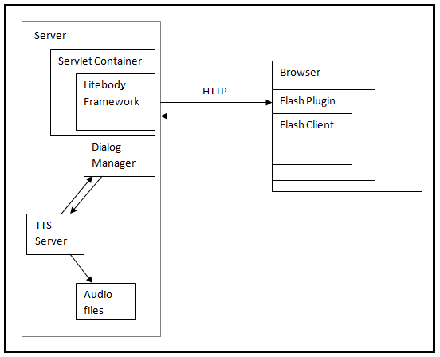

LiteBody: Installation, Configuration and Deployment Guide
====

The following document is a brief description of how to configure and deploy litebody along with its dialogue manager.

#### Servlet Deployment Overview

The project is to be deployed as a Java servlet and are deployed on the server using a compliant "servlet container".  Further documentation would provide instructions specific to Apache Tomcat as a servlet container.

#### Block diagram
The above figure provides an overview on how the components interact with each other. 

#### Minimum Server Requirements:

- Windows XP or greater/Linux
- 1.5ghz Processor
- 2GB of RAM
- 1+GB of Hard Drive space.

#### Setting up the server

Further instructions on setting up the litebody assumes installation of JRE and [Tomcat](http://tomcat.apache.org/) on the server, and the Adobe Flash web-browser plugin on clients.
  
The LiteBody server has been configured to use the FreeTTS or [Loquendo](http://www.loquendo.com) (via their proprietary API) speech synthesizers; the following walks through installation with FreeTTS. 

Add the following files in the lib folder of the Litebody TTS project.

From [FreeTTS](http://freetts.sourceforge.net/) site, download the following files:

- cmu_time_awb.jar 
- cmu_us_kal.jar 
- cmudict04.jar 
- cumlex.jar 
- cmutimelex.jar 
- en_us.jar 
- freetts.jar 

If you are using the FreeTTS engine, you will need to download the following jars from [Tritonus](http://www.tritonus.org/) site:

- tritonus_mp3-0.3.6.jar
- tritonus_share-0.3.6.jar 

If you are using the Loquendo TTS engine, you will need to download and compile the following dlls/so. The files to compile the dlls/so can be found at [here](http://lame.sourceforge.net/), then build the following .so or .dll files for based on your server's operating system: 

- lame_enc.dll (for windows)
- lametritonus.dll (for windows)
- liblametritonus.jnilib (for both)
- liblametritonus.so (for linux)
- libmp3lame.dylib (for linux)

#### Deploy a webAgent server

- For the litebody project, build an executable JAR file by using the Ant tool (build.xml file). Once the build is successful, it would generate a “litebody.jar” file
- In webapps folder of the tomcat directory, copy over the webAgent project
- In the webAgent project folder, create a “WEB-INF” folder. Also create a “lib” folder (WEB-INF\lib) and copy the “litebody.jar” generated above in the lib folder.
- Create a web.xml file with the needed configuration settings. More information on how to setup the web.xml file is given in the “web.xml overview” section below.
- Modify the serverURL value in the webAgent.properties file to point to the correct URL. The location of the properties file is under the Config folder in webAgent project.
- Start tomcat service and check if the tomcat home page shows up on the browser when requested for http://localhost:8080
- Open the url, http://localhost:8080/&lt;project-name&gt;/agent to check to see if the deployment was successful.&lt;/project-name&gt;

#### Deploy the Litebody Client

- To deploy the Litebody Client, download the LiteBodyClient project from svn and open webAgent.fla using Flash CS4 or above.
- Once you have loaded up the fla file, publish the project, and place the resulting swf and html file inside the appropriate folder in your tomcat webapps folder.
- Inside the webapps folder containing the swf and html file, create a new folder called Config, and create a webAgent.properties file with the following information in it:
- (Without the quotes) "serverURL=http://serverURL/agent", for additional options, please read the example webAgent.properties provided in the SVN.
- Start the tomcat service, and check navigate to the html to start interacting with the system.
   
Please note that a sample configuration of the project is provided in the repository under the litebody-test folder.

#### Overview of web.xml

All configuration for litebody is done in the web.xml file.  This example shows the general layout of the file.  Note that the servlet standard gives a lot more possible configuration; this is just what we're using at the moment.  Most of the interesting configuration is in the "init-param" elements.


<?xml version="1.0" encoding="utf-8"?>
<web-app xmlns="http://java.sun.com/xml/ns/j2ee"
     xmlns:xsi="http://www.w3.org/2001/XMLSchema-instance"
     xsi:schemaLocation="http://java.sun.com/xml/ns/javaee 
		http://java.sun.com/xml/ns/javaee/web-app_2_5.xsd"
     version="2.5">
  <display-name>Testing the new Litebody protocol</display-name>
  
  <servlet>
    <servlet-name>Agent</servlet-name>
    <servlet-class>webframe.WebFrameServlet</servlet-class>
    <load-on-startup>1</load-on-startup>
    <init-param>
      <param-name>webframe.dialogue-manager</param-name>
      <param-value>webframe.DialogueTest</param-value>
    </init-param>
    <init-param>
      <param-name>webframe.validation</param-name>
      <param-value>true</param-value>
    </init-param>
    <!-- Additional parameters go here -->
  </servlet>

  <servlet-mapping>
    <servlet-name>Agent</servlet-name>
    <url-pattern>/agent/*</url-pattern>
  </servlet-mapping>
  
  <filter>
    <filter-name>ForceCacheValidation</filter-name>
    <filter-class>webframe.ForceCacheValidation</filter-class>
  </filter>
</web-app>


#### Configuration Parameters

<table>
    <tbody>
        <tr>
            <th>Property</th>
            <th>Default</th>
            <th>Description</th>
        </tr>
        <tr>
            <td>webframe.dialogue-manager</td>
            <td>REQUIRED</td>
            <td>fully-qualified class name of an implementation of the
    DialogueManager interface</td>
        </tr>
        <tr>
            <td>webframe.user-manager</td>
            <td>NONE</td>
            <td>fully-qualified class name of an implementation of the
    UserManager interface; allows an app to customize
    things like user authentication.</td>
        </tr>
        <tr>
            <td>webframe.log-manager</td>
            <td>NONE</td>
            <td>fully-qualified class name of an implementation of the
    LogManager interface; allows an app to customize logging conversation events.</td></tr>
        <tr>
            <td>webframe.session-timeout-minutes</td>
            <td> 10 minutes</td>
            <td>A conversation is considered to be terminated if there
    is no contact from a client within this time period</td>
        </tr>
        <tr>
            <td>webframe.session-timeout-poll-minutes</td>
            <td>value of session-timeout-minutes</td>
            <td>the litebody polls at this interval to check if any idle conversations should be terminated</td>
        </tr>
        <tr>
            <td>webframe.tts.server</td>
            <td>localhost</td>
            <td>hostname of TTS server</td>
        </tr>
        <tr>
            <td>webframe.tts.port</td>
            <td>7000</td>
            <td>port# of TTS server</td>
        </tr>
        <tr>
            <td>webframe.tts.voice</td>
            <td>Susan</td>
            <td>TTS voice to request from the TTS server</td>
        </tr>
        <tr>
            <td>webframe.validate</td>
            <td>FALSE</td>
            <td>if true, outgoing messages are checked against the
            XML schema; this is good for debugging</td>
        </tr>
    </tbody>
</table>
