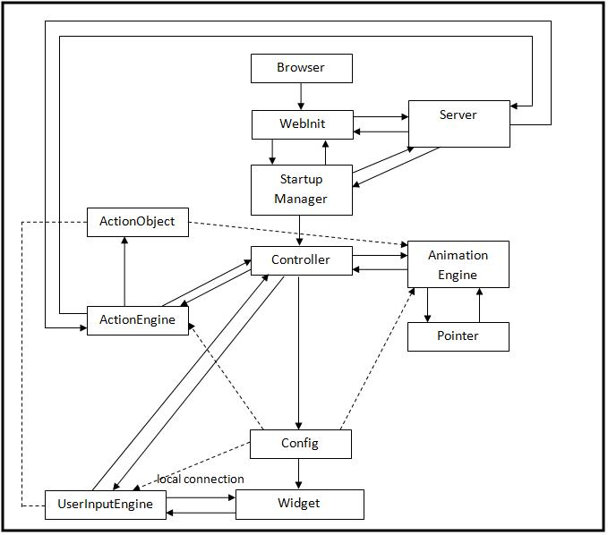
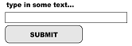
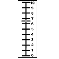

LiteBody: Client-Server Communication Protocol
====

The server is deployed at a URL that is known to the client: the **agent URL**. Messages sent to this URL either request information about the agent as a whole, or request a new conversation.

Each conversation is assigned a conversation URL by the server. To carry on a conversation once started, the client sends messages to the **conversation URL**.

All messages sent by the client may include parameters in a key-value form, passed in as for an HTML form:

- for GET messages: in the query string portion of the URL

- for POST messages: in the message body, with content type application/x-www-form-urlencoded
   
Some parameters are common to all messages (but may be optional).

- action identifies the type of message

- user and pass are used for authentication
   
Below is a block diagram of various components and their interaction between other components.



Interaction with the Agent URL
----

   - A GET message to the agent URL requests overall status and info.
   - A POST message requests a new conversation.

#### Agent Description
The server responds to a GET message with an agent description, including:

- list of active conversations,
- The version of the protocol in use, and
- The type of authentication required:
- NONE --> no username/password is needed
- REQUIRED --> a username/password is always needed
- OPTIONAL --> may use a username/password, or interact as a "guest" (NOT IMPLEMENTED)

```
- agent ::= <AGENT VERSION="int.int" AUTHENTICATION="authType">; conversation* </AGENT>;
- conversation ::= <CONVERSATION URL="url" />;
- authType ::= NONE | OPTIONAL | REQUIRED 
```

#### Conversation Startup

A POST message to the agent URL requests a new conversation. The server replies with a conversation description containing the new conversation URL in the case of success. If the conversation could not be started, the server must reply with an HTTP error.

Parameters:
```
- action=start
- user=<string> (optional if "guest" users are allowed) </string>
- voice=<string> (optional) </string>
```
Messages to a Conversation URL
----


- **xml:base** defines the base URL for any relative URLs within this
message.
- **ACTIVE** says whether this is a past or current conversation 
- **&lt;VIEW&gt;** and **&lt;ACTION&gt;** elements identify additional actions that can be used with GET or POST respectively (implemented by the dialogue manager).


    
<CONVERSATION xml:base="[URL]" URL="[URL]" ACTIVE="[true|false]">
(<VIEW ID="[string]"/>)*
(<ACTION ID="[string]"/>)*
</CONVERSATION>;
    


#### POST messages

A POST message to a conversation URL is a request to advance the state of the conversation. All POST messages are in the form of an XML document.  The server replies with the next action message.

- action=performComplete[&amp;warning=<string>]*  -- client is finished executing last perform, ready for next message; warning, because the client is allowed to report (non-fatal) warnings with perform complete</string>
- action=menuInput&amp;choice=&lt;int&gt;   -- multiple choice user input
- action=textInput&amp;value=&lt;string&gt;  -- text entry user input
- action=widgetInput&amp;value=&lt;string&gt;  -- user input from a custom input widget   
- action=error[&amp;cause=&lt;string&gt;]?  -- the client got a message it couldn't execute for some reason.
- action=timeout  -- client timed out on user input
- action=exit  -- client is terminating the conversation
- optional parameter: reason=&lt;string&gt;
	
#### GET messages

A GET message is a request for some status, and does not change the state of the conversation. GET messages may have a query parameter called "action" which specifies what information is requested. If not supplied, the default is "action=description".

- action=description --> request a conversation description 
- action=lastMessage --> request the last command message from the server
- action=plan (DTask only) --> request the current plan tree
- additional types of status may also be supported

<p></p>

Replies from a Conversation URL
----

Litebody Protocol offers several elements for interaction. A specific response from the agent could contain ONE of the following elements; **Input element** OR **Perform element** OR **Exit element**. 

**The <span class="highlight">INPUT</span> element:**

The input element specifies the type of input the user would be provided with to interact with the agent. The input element could consist of either one of the following types: Menu, FreeText and Widget. The input element also contains a timeout attribute. The timeout value specifies the time (in seconds) the input type should show up before it times out. The timeout is optional, and if not provided, its an infinite timeout.

The different types of input elements are as follows:

   - **Menu:** A menu must contain atleast one item as option. The user has to select the answer from the options provided in the menu to respond to the agent.
   - **FreeText:** 
A freetext is another input type which allows the user to enter textual input unlike selecting predefined options in menu. It has a mandatory attribute ‘prompt’. Another attribute in freetext element is the ‘lines’, which is an optional attribute. The ‘lines’ specify if the input is a single or multiple line input. If the attribute is not present, the default value considered is Single.
   - **Widget:** 
The widget allows for extensibility with arbitrary additional input types. Slider is one example of a widget. It contains attribute ‘parameter’. It also contains the ‘url’ mandatory attribute which specifies the location of the SWF file implementing the widget. Another attribute of the widget element is the ‘size’. Its default value is ‘DEFAULT’. It can also have ‘FULL’ and ‘AGENT’ as input options.
   
**The <span class="highlight">PERFORM</span> element:**
The element contains synchronized and/or unsynchronized elements. Synchronized events contain either eyebrow gestures, audio, duration, etc. The “synchronized” events are synchronized with audio, and occur at specified frame numbers. The “unsynchronized” events occur serially, and timing is not specified; the client is free to perform them at whatever speed is appropriate. It could be a posture shift, eye gaze, clear page, pointer, expression, background, headnod, etc.

Any URL within PERFORM (audio, images, etc.) is allowed to be a relative URL.  If so, it should be resolved using the **xml:base** element on &lt;perform&gt;

- **Synchronized elements:**

    - **Brows:** The brows element directs the brows of the agent. It has an attribute, ‘value’ that could have either ‘FLAT’, ‘POINTDOWN’ or ‘POINTUP’ as its value. The timestamp attribute is a non-negative integer that specifies the amount of time the specified brow motion should be displayed..
    - **Viseme:** The viseme element also contains attribute ‘value’ which is of type integer and a ‘timestamp’ attribute, a non-negative integer..
    - **audioURL:** The ‘audioURL’ is a mandatory attribute of the synchronized element that specifies the url value which points to the audio file..
    - **duration:** The ‘duration’ is another mandatory attribute of the synchronized element

- **Unsynchronized elements:**

    - **posture:** This element specifies the posture of the agent
    - **gaze:** The gaze element specifies the direction of the gaze, away or towards using the element’s ‘direction’ attribute.
    - **clearPage:** It should occur exactly once.
    - **page:** The mandatory ‘page’ element can occur only once and specifies the displayed page details. The attributes’ ‘url’ specifies the page url and the ‘type’ provides the type of the displayed page, either html or image (suported image formats: png and gif). The optional ‘size’ attribute specifies the size of the page. Also, if the page needs any authentication, it is specified using the optional ‘auth’ attribute.
    - **pointer:** The pointer element directs the agent to display a finger pointing at a specific location. The pointer element has three mandatory attributes; viz. shape, x and y. The shape specifies if the pointer is a hand or a point gesture. The ‘x’ and ‘y’ attributes specify the coordinates in cartesian plane.
    - **expression:** The expression element contains a ‘type’ attribute that specifies agent’s expression, either happy, warm or concern.
    - **delay:** It specifies the duration in milliseconds the agent has to wait before performing any subsequent events. The time is specified using the ‘duration’ attribute.
    - **background:** The background element contains the ‘url’ attribute that specifies the background image source. The image source could be either of png or gif image format.
    - **clearPointer:** This element terminates the events generated through ‘pointer’ element specified above. For example, if a pointing hand is been displayed using the ‘pointer’ element, the use of clearPointer element should remove it.
    - **clearBackground:** clears out the background generated using the ‘background’ element
    - **headNod:** performs head nodding gesture using the element
    - **debug:** allows debugging
   
**The <span class="highlight">EXIT</span> element:**

The element can contain an optional ‘url’ attribute and an optional ‘reason’ attribute to specify the reason for exit.

Authentication and Authorization
----

When the server reports in the agent description that authentication is needed,
the client should append additional parameters to every subsequent request:

 - **user**=&lt;string&gt;
 - **pass**=&lt;string&gt;

Authentication, if required, must be used for every request made by the client except for a
GET message to the agent URL (which returns the agent description).

The server reports authentication and/or authorization failures with the following HTTP error codes:

 - **401 Unauthorized** -- bad username, or no authentication provided
 - **449 Retry With** -- bad password


Notes:
-----

This spec describes authentication but does not by itself provide any security, as usernames and passwords are sent in cleartext. If security is desired, layer this protocol over HTTPS rather than HTTP.
